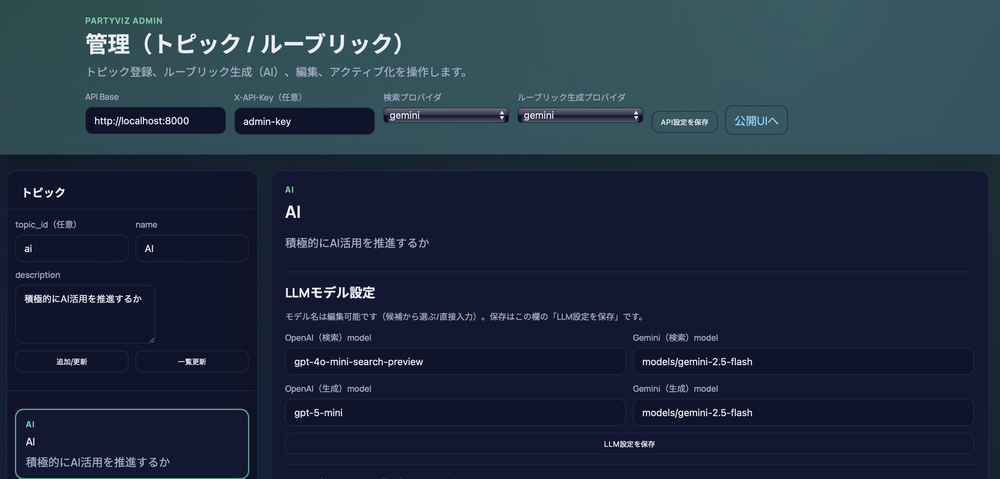
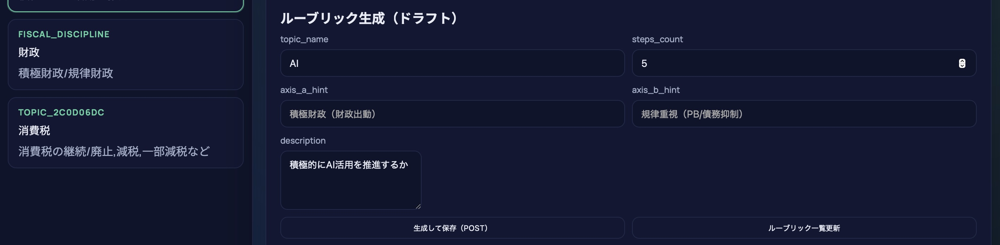
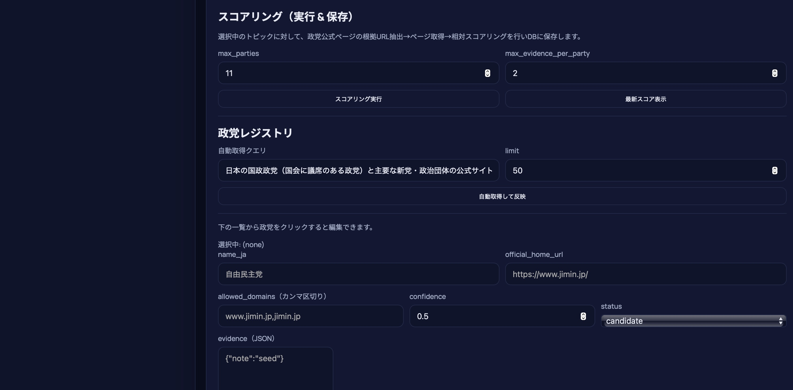
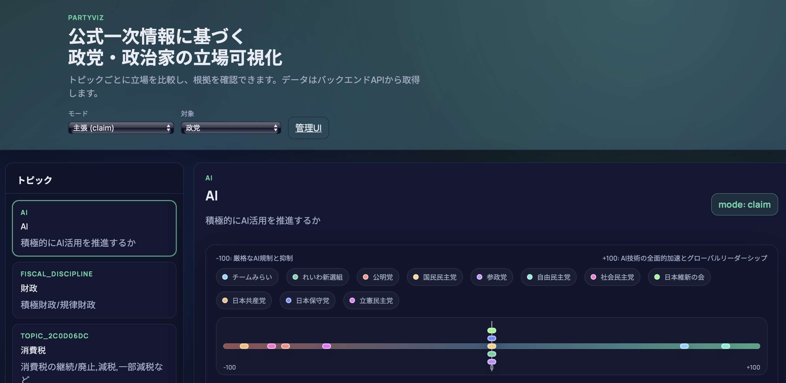
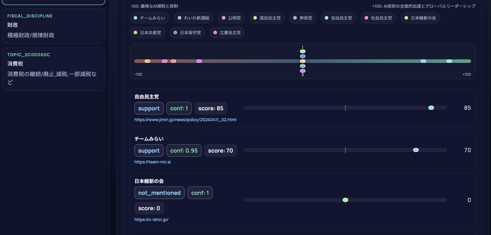
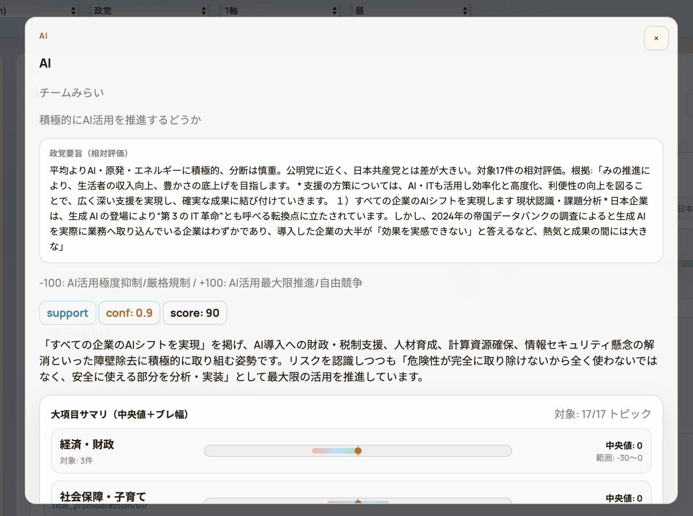
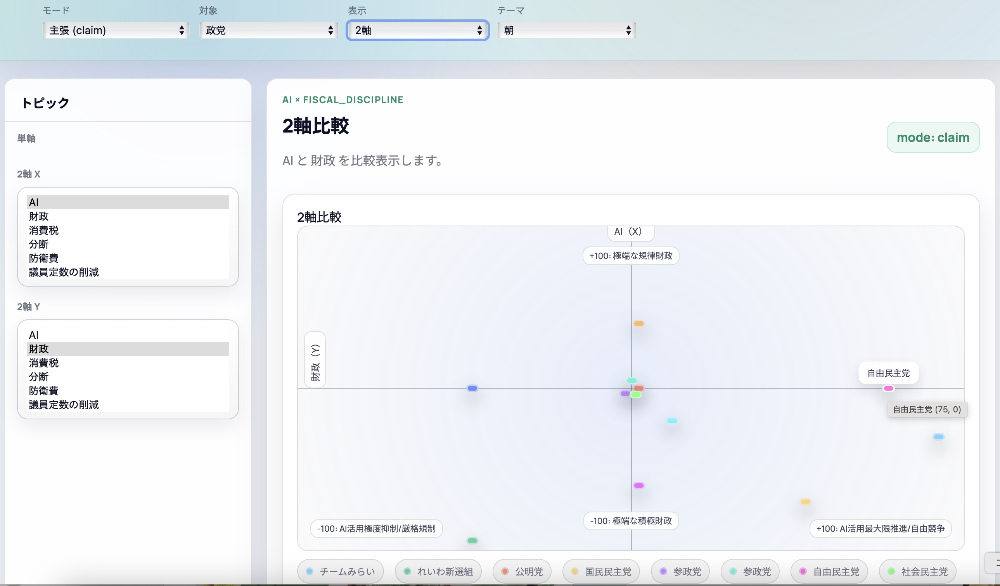

# 各政党の考え方を可視化するアプリケーション

仕様書に基づき、政党・政治家の立場を公式一次情報から可視化するアプリケーションの開発リポジトリです。現時点ではMVP実装（政党レジストリ管理/ルーブリック生成/スコアリング/可視化UI）を含みます。

- 仕様: 仕様書.md
- 開発計画: docs/development-plan.md
- バックエンド: backend/

## 解説記事
https://zenn.dev/ryo_saotome/articles/4bb384dfd438fe

## 必要なもの
- Python 3.12+
- PostgreSQL 15+（ローカルで動かす場合）
- OpenAI APIキー or Gemini APIキー（スコアリング実行で使用）

## クイックスタート（最小）
1) `.env` を作成
```bash
cp .env.example .env
```
`.env` に `DATABASE_URL`, `ADMIN_API_KEY`, `OPENAI_API_KEY`/`GEMINI_API_KEY` を設定します（`.env` はGit管理外）。

2) 依存インストール & DBマイグレーション
```bash
cd backend
pip install -r requirements.txt
alembic upgrade head
```

3) バックエンド起動
```bash
cd backend
uvicorn src.main:app --reload --port 8000
```

4) フロント起動（別ターミナル）
```bash
cd frontend
python -m http.server 5173
```
ブラウザで `http://localhost:5173/` を開きます。

## PostgreSQLセットアップ（ローカル例）
すでに `partyviz` DB/ユーザーがある場合は読み飛ばしてください。

個別設定については `docs/local-config.md` を参照し、`.env` を各自で作成してください（Git管理外）。

### macOS（Homebrew）
```bash
brew install postgresql@15
brew services start postgresql@15

# DB/ユーザー作成（例）
createdb partyviz
createuser -s partyviz
psql -d postgres -c "ALTER USER partyviz WITH PASSWORD 'partyviz';"
psql -d postgres -c "GRANT ALL PRIVILEGES ON DATABASE partyviz TO partyviz;"
```
`.env` の `DATABASE_URL` は `.env.example` の形式に合わせてください。

## フロントエンド（静的Web UI）
```bash
# 別ターミナルで
cd frontend
python -m http.server 5173
# ブラウザで http://localhost:5173 にアクセス
```

バックエンドAPIが 8000 番で起動している前提です。ポートを変える場合はブラウザの localStorage (`partyviz_public_api_base`) を変更してください。


## 管理UI（トピック/ルーブリック/政党レジストリ/スコアリング）

同じ静的サーバで `http://localhost:5173/admin.html` を開き、`API Base`（例: `http://localhost:8000`）と `X-API-Key`（`ADMIN_API_KEY` を設定している場合）を入力してください。

管理UIでは、検索（政党自動取得）とルーブリック生成/スコアリングで使うプロバイダ（OpenAI/Gemini）とモデル名も指定できます（モデル名は自由入力）。設定はブラウザの localStorage に保存されます。

メインUIで実データを表示するには、管理UIで以下を行ってください:
- トピック作成 → ルーブリック生成/有効化
- 政党レジストリを作成（自動取得 or 手動登録）し `official_home_url` を埋める
- 「スコアリング実行」でスコアをDB保存

## UI操作方法（現時点）

### 1) 管理UI（`/admin.html`）
 

**A. 初期設定**
1. `API Base` にバックエンドURL（例: `http://localhost:8000`）を入力
2. `ADMIN_API_KEY` を設定している場合は `X-API-Key` を入力
3. 「API設定を保存」を押す

**B. LLM設定（任意）**
1. 「検索プロバイダ」「ルーブリック生成プロバイダ」を選択（`auto|gemini|openai`）
2. OpenAI/Geminiのモデル名を入力（候補から選択または自由入力）
3. 「LLM設定を保存」を押す

**C. トピック作成**
1. `name` と `description` を入力（`topic_id` は空でもOK）
2. 「追加/更新」を押す

**D. ルーブリック生成 → 有効化**
 
 
1. トピックを選択
2. 「ルーブリック生成（ドラフト）」で必要なら `axis` ヒントや `steps_count` を入力
3. 「生成して保存（POST）」を押す
4. 作成されたルーブリックが一覧に表示されるので、必要なら編集して「保存（PATCH）」
5. 「Activate（POST）」で有効化（同一トピックの既存activeはarchivedへ）

**E. 政党レジストリ（自動取得/手動/編集）**

- 自動取得: 「自動取得クエリ」を必要に応じて調整 → 「自動取得して反映」
- 手動登録: `name_ja` / `official_home_url` / `allowed_domains` 等を入力 → 「登録（POST）」
- 個別編集: 一覧の政党をクリック → フォームに反映 → `official_home_url` や `evidence(JSON)` を編集 → 「更新（PATCH）」
- 政策URL登録/クロール: `policy_base_urls` に複数URLを登録 → 「政策URLをクロール」

**F. スコアリング（実行 & 保存）**
1. トピックを選択
2. `max_evidence_per_party` を調整（必要なら）
3. 外部ページも使う場合は「外部ページも含める（mixed）」をON
4. 必要なら「policy index only」をON（検索ベースを使わず、インデックスのみ）
5. 「スコアリング実行」を押す（根拠URL抽出→取得→相対スコア算出→DB保存）
6. 「最新スコア表示」で最新結果を確認

**G. スナップショット出力（静的公開用）**
1. 管理UIの「スナップショットをダウンロード」を押す
2. 出力された `snapshot.json` を `frontend/data/snapshot.json` に配置
3. 公開UIは `http://localhost:5173/?source=snapshot` で確認可能

### 2) メインUI（`/`）
 



1. 左のトピックリストから選択（1軸/2軸を切替可能）
2. 上部の軸ラベル（-100/+100）を確認して、各政党の位置を把握
3. 軸上の点、または各政党行の点をクリックすると、根拠（URL/抜粋）を含む詳細オーバーレイを表示
4. 「評価基準を見る」からルーブリックの詳細を確認
5. テーマ（深夜/朝/昼）を切り替え可能

※ メインUIに「データがありません」と出る場合は、管理UIで「スコアリング実行」を行ってスコアがDBに保存されているか確認してください。

## DBマイグレーション（Alembic）
```bash
cd backend
alembic upgrade head
```

## 想定スタック（暫定）
- FastAPI / Uvicorn（APIサーバ）
- PostgreSQL（スコア・レジストリ管理）
- Redis もしくは DB キャッシュ（可視化API高速化）
- 生成AI: OpenAI API と Google Gemini を併用（`.env` に API キーを保存）
- ORM: SQLAlchemy（`backend/src/db/models.py` にparty系モデル定義済み、adminでCRUDスタブあり）
- 管理API: `ADMIN_API_KEY` を設定すると `X-API-Key` ヘッダで保護（未設定時は開発用として無認証）
- エージェントPoC: `backend/scripts/agent_poc.py` で Discovery→Resolution→Crawler→相対スコア算出を通し検証可能（OpenAI/Geminiキーがあれば実LLMで実行）
- 依存追加が必要な場合はネットワーク制約に注意（bs4は未使用化済み）
- コスト見積もり: `docs/cost-estimate.md`
- ルーブリック（スコア表）: `topic_rubrics` テーブルに保存、生成AIでドラフト生成→人が編集→有効化（管理API）

## ルーブリック（スコア表）管理（Admin API）

マイグレーション適用後に利用できます。

```bash
cd backend
alembic upgrade head
```

例（APIキー認証が有効な場合は `-H "X-API-Key: ..."` を付与）:

- トピック登録/更新: `PUT /admin/topics/{topic_id}`
- ルーブリック生成（ドラフトをDBに保存）: `POST /admin/topics/{topic_id}/rubrics/generate`
- ルーブリック一覧: `GET /admin/topics/{topic_id}/rubrics`
- ルーブリック編集: `PATCH /admin/rubrics/{rubric_id}`
- ルーブリック有効化（同topicのactiveはarchivedへ）: `POST /admin/rubrics/{rubric_id}/activate`
- 政党レジストリ自動取得（LLM検索→DBへupsert）: `POST /admin/parties/discover`
- 政党の個別編集: `PATCH /admin/parties/{party_id}`（管理UIで一覧から選択→編集）
- 開発用データ削除（危険、`confirm=DELETE` 必須、`ADMIN_API_KEY` 必須）: `POST /admin/dev/purge`
- スコアリング実行（根拠URL抽出→取得→相対スコア算出→DB保存）: `POST /admin/topics/{topic_id}/scores/run`
- 最新スコア取得: `GET /admin/topics/{topic_id}/scores/latest`
- ルーブリック取得（公開）: `GET /topics/{topic_id}/rubric`

## トラブルシュート
- `401 Invalid API key`: `.env` の `ADMIN_API_KEY` と、管理UIの `X-API-Key` が一致しているか確認
- `404 no score run` / 「データがありません」: 管理UIで対象トピックの「スコアリング実行」を行ったか確認
- `psycopg OperationalError`（role does not exist 等）: `DATABASE_URL` のユーザー名/DB名が実在するか確認
- `alembic upgrade head` が失敗: `DATABASE_URL` を `.env` に設定してから実行

## GitHubに上げる前のチェック
- `.env`, `.env.*`, `.venv/`, `backend/runs/` がコミットされていない（`.gitignore` 済み）
- `alembic upgrade head` が通る
- `uvicorn src.main:app --reload --port 8000` と `python -m http.server 5173` でUIが開ける
- `http://localhost:5173/admin.html` でトピック作成→スコアリング実行→ `http://localhost:5173/` で可視化が表示される
- `http://localhost:5173/rubric.html?topic=ai` でルーブリック詳細を表示

コマンドラインで実行する場合:

```bash
cd backend
python scripts/discover_party_registry.py --query "日本の国政政党 公式サイト 一覧 チームみらい" --limit 50
```

## 次ステップの例
- docs/development-plan.md に従い、APIのスキーマとDBマイグレーションを実装
- データパイプライン（Discovery/Resolution/Crawl/Score）の実装着手
- フロントエンドのUIプロトタイプ作成

## Web公開（低コスト）
低コスト/無料での公開案は `docs/deployment.md` を参照してください。
静的公開（APIを公開しない）に切り替える場合は、管理UIから `snapshot.json` を出力して `frontend/data/snapshot.json` として配置します（詳細は `docs/deployment.md`）。
GitHub Pages で `frontend/` を公開する場合は、GitHub Actions によるデプロイ（`.github/workflows/pages.yml`）を使います（Pages設定の Source を GitHub Actions に変更）。
スナップショットにはルーブリックやスコア実行情報も含まれます。

## ライセンス
MIT License（`LICENSE` を参照）
